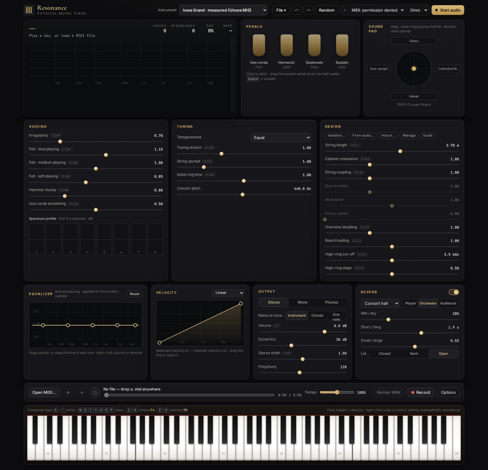

# Resonance

A physical-model instrument that runs in the browser. There are no samples: every note is built in real time
from measured overtone data (levels, frequency ratios, two-stage decays), and a full set of
sound-design controls reshapes it live.



## Run

```bash
./run.sh            # serves on http://0.0.0.0:9040  (./run.sh 8123 for another port)
```

- On this machine, open `http://localhost:9040`.
- From another device, serve it over HTTPS (any reverse proxy; the app's on-screen hints assume it listens on
  `https://<host>:9041` and forwards to :9040). Browsers only allow MIDI keyboards
  on HTTPS or localhost.
- Plain `http://<ip>:9040` also plays, with a little more latency.

## Playing

- **Computer keyboard:** the home row plays white keys and the row above black keys (<kbd>A</kbd> <kbd>W</kbd> <kbd>S</kbd> <kbd>E</kbd> <kbd>D</kbd>
  <kbd>F</kbd> <kbd>T</kbd> <kbd>G</kbd> <kbd>Y</kbd> <kbd>H</kbd> <kbd>U</kbd> <kbd>J</kbd> <kbd>K</kbd> <kbd>O</kbd> <kbd>L</kbd> <kbd>P</kbd> <kbd>;</kbd> <kbd>'</kbd>).
  <kbd>Z</kbd> / <kbd>X</kbd> change octave, <kbd>C</kbd> / <kbd>V</kbd> change the key velocity, <kbd>Space</kbd> is the sustain pedal,
  <kbd>Ctrl</kbd>+<kbd>Z</kbd> / <kbd>Ctrl</kbd>+<kbd>Y</kbd> undo and redo.
- **Mouse or touch:** click the on-screen keyboard (lower on the key = louder), latch the pedals, drag the sliders (hold <kbd>Shift</kbd>
  for fine steps, double-click to reset, right-click for MIDI learn).
- **Sliders by keyboard:** <kbd>Tab</kbd> to a slider, then arrows (1%, <kbd>Shift</kbd> 0.2%), <kbd>PageUp</kbd> / <kbd>PageDown</kbd> (10%), <kbd>Home</kbd> / <kbd>End</kbd>, <kbd>Delete</kbd> to reset.
- **MIDI keyboard:** see [MIDI](#midi) below. On a phone the interface stacks into one column.

## Sound pad

The circle next to the pedals blends four sounds with one gesture. Drag the puck: the centre is the neutral sound
(Concert Grand), and the poles are **Glass** (north: hard, bright, percussive), **Cathedral Bloom** (east: huge, resonant,
long), **Velvet** (south: soft, dark, long) and **Tack Upright** (west: small, honky, short). Halfway between two poles
gives an even mix. The poles are reached at 74% of the radius. The outer ring pushes past them, up to 1.35 times the
change from the centre, clamped to each slider's range, so the edge of the pad is more extreme than any stored sound.
Double-click or press <kbd>Home</kbd> to return to the centre, arrow keys nudge the puck, and the four menus around the
circle choose which sound sits at each pole (ten built in, plus your own presets).

Only continuous settings blend (sliders and the spectrum profile), so the pad never reloads the instrument or rebuilds the
reverb. The puck position is part of the sound, so undo, redo, exporting a preset and reloading the page all restore it.

There is no preset dropdown any more: the **Instrument** menu sits in the top bar, and File > Export/Import preset saves and loads a whole setting (the presets still feed the pad and Program Change).

## MIDI

| Message | Effect |
|---|---|
| Note on / off | Notes with velocity (any channel, or one you choose). |
| CC 64 / 66 / 67 / 69 | Sustain (with half-pedal), sostenuto, una corda, harmonic pedal. |
| Pitch bend | Bends every sounding and new note. The range is the *Pitch-bend range* setting under Options (2 semitones by default). |
| Channel and polyphonic pressure | Arrive as a learnable source called *AT*. Right-click any slider, choose *MIDI learn…*, then press the keys. |
| Any other CC | Right-click a slider, *MIDI learn…*. The default map is shown on each slider (CC102 string spread, CC106 medium felt…). |
| CC 120, 123 | All sound off / all notes off. CC 121 (reset controllers) recentres the pitch wheel. |
| Program change | Selects the preset at that position in the built-in preset list (no longer shown as a menu), if *Listen to Program Change* is on. |

MIDI files (type 0 and 1) play with their tempo map, pedals and pitch bend. *Save played MIDI* writes notes and controllers
(not pitch bend) from what you play.

## Offline and install

After the first visit on `localhost` or over HTTPS a service worker keeps a copy of the whole app, fonts included, so it
works with no network and can be installed from the browser menu. It asks the network first, so an update you deploy
shows up on the next load. Plain `http://<ip>` pages skip the service worker.

## Instruments

| Source | How |
|---|---|
| Built-in | **Iowa Grand**, measured with the analyzer from the University of Iowa Musical Instrument Samples (free for any use). |
| **Variation…** | A joystick that blends four random variations of an instrument (the measured Iowa Grand, or a synth): every key, velocity layer and overtone gets its own level, decay and frequency, and brightness, sustain and inharmonicity change smoothly across the keyboard. The middle is the original, the outer ring goes past the corners. The **Kind** menu also builds synth sounds from physics (electric piano, church bell, tonewheel organ with a rotary speaker, pad, marimba, vibraphone, analog lead, strings, flute, brass, a drum kit) in exact equal temperament ([how it works](docs/GENERATOR.md)). |
| **From audio…** | Build an instrument from recordings you already have (wav, mp3, flac, ogg, aiff): drop the files on the page or choose them, and Resonance places each on a piano bar by its name (`C4`, `F#3`, `Piano.mf.Eb3`, `A0_v40`) or, if the name says nothing, by its detected pitch. Click any key on the bar to choose its file by hand; several files on one key become its strengths (by name, else by loudness). It measures every note in the browser, matches the loudness of each against its recording, and saves the instrument. |
| **Import…** | Any `resonance-instrument/1` file ([format](docs/INSTRUMENT_FORMAT.md)), e.g. from `tools/analyze_instrument.py`. |

Imported, measured and varied instruments are stored in the browser (IndexedDB). You can export or delete
them under **Manage**.

## Measure from existing recordings

```bash
pip install numpy scipy soundfile
python3 tools/analyze_instrument.py --name "My piano" --out my_piano.json recordings/*.wav   # C4_mf.wav, A0_v40.flac …
```

The full recording guide is in the app (**Guide**) and in [docs/measuring.html](docs/measuring.html).

The analyzer (Python and the in-browser `js/analyzer.js`) does the following for each note:
1. finds the onset
2. uses the silence before it as the noise floor
3. detects the key release
4. fits the pitch and the string inharmonicity, or picks the real overtone peaks for bars and bells
5. demodulates each overtone into an energy envelope
6. fits a two-stage (direct + remanent) decay to each

## Model other instruments from recordings

`From audio…` builds a piano-style instrument in the browser. For a folder of single-note recordings of anything else there are command-line tools:

```bash
python3 tools/build_sampled_set.py RECORDINGS_DIR      # one sub-folder per instrument: clarinet-b3.wav, flutes-stc-rr1-a3.wav, piano-f-a1.wav ...
```

It writes one `resonance-instrument/1` file per folder and articulation into `_resonance/` (load them all at once with **Import…**, which takes several files).
To have the server list a folder of these files in the model menu, start it with `node serve.mjs --instruments DIR` (or `RESONANCE_INSTRUMENTS=DIR`).
Struck, plucked and staccato notes (piano, harp, `piz`, `stc`) go through `tools/analyze_instrument.py`. Sustained notes (strings, woodwinds, brass) go
through `tools/analyze_sustained.py`, which measures for each note the held harmonics, the attack time, the vibrato (rate, depth, when it sets in) and the
noise between the harmonics (three bands), and writes them as an engine `synth` block (see [format](docs/INSTRUMENT_FORMAT.md)); every instrument is then set to the
playing loudness of the Iowa Grand (`tools/normalise_level.py`). `tools/fidelity_sustained.py` scores an instrument against its own recordings: on a sampled
folder of 11 sustained instruments the timbre error is 3 to 10 dB, level, attack time and vibrato depth match, and every slider passes `test/sliders.test.mjs`.
Winds and brass play one note at a time by default, as the real instruments do; the **Notes at once** switch in the Output card (Instrument / Chords / One note) lets any of them play chords, or forces one note at a time on any instrument.
Check the licence of your recordings before you publish anything built from them.

## Checking accuracy

```bash
npm test                      # engine (finite, level, release, real-time, velocity extremes, pitch bend), sound pad,
                              # MIDI/WAV files, in-browser analyzer against synthetic truth and against the Python one, offline shell
npm run test:generators       # variations of the measured instrument x seeds: valid, audible, in tune, decays
npm run test:ui               # the real page in Chromium: sound pad, undo, keyboard use, accessible names, offline reload
                              # (needs Playwright: npm i -D playwright && npx playwright install chromium)
npm run test:all              # all of the above. Run it before you push: GitHub Actions is switched off for this repo
                              # (the workflow in .github/workflows/test.yml runs the same commands if you ever turn it on)
python3 tools/fidelity.py my_piano.json recordings/ --hide 2   # how closely the engine reproduces recordings,
                                                               # scored on keys it was never given
```

`fidelity.py` reports the level error at the attack and the envelope error (dB) at 0.1, 0.5, 1, 2 and 4 s (relative to the
loudest 50 ms of the attack), per register group and overall. Lower is better. `--hide N` drops every Nth measured key first and scores only those keys.

To close the gap the analyzer leaves (it fits one smooth decay law across the keyboard, which is weak in the top
octaves), run the calibrator. It renders every key through the real engine and adjusts decay scales, per-layer
levels, the default inharmonicity and the treble unison detunes to match the recordings:

```bash
python3 tools/calibrate_to_recordings.py my_piano.json my_piano_cal.json recordings/*.wav
```

## Engine

`js/engine.worklet.js` runs as an AudioWorklet (on plain-http pages it falls back to running on the main thread).
- **Notes:** each note is a bank of phasor oscillators with exponential decays, interpolated between measured
  keys and velocity layers (`js/instrument.js`).
- **Controls:** every sound-design control acts relative to the data, so default settings reproduce the
  measurement. Hardness and velocity tilt the spectrum (each partial's amplitude follows a power of the strike speed whose exponent grows with its frequency; see the format doc); soundboard impedance, cut-off and Q reshape the
  decays; piano size rescales the inharmonicity; unison width detunes the strings.
- **The mathematics and the papers behind it** (which parts follow the literature and which are our own fits) are in
  [docs/THEORY.md](docs/THEORY.md).
- **Also modelled:** sympathetic string resonance, cabinet resonance, dampers, four pedals (with half-pedal and
  sostenuto), historical temperaments, reverb and mechanical noises.

## Files

| Path | What |
|---|---|
| `index.html`, `css/`, `js/main.js` | UI, MIDI input, MIDI file player, WAV render and record |
| `js/engine.worklet.js` | synthesis engine |
| `js/instrument.js` | instrument format: validation, compilation, browser storage |
| `js/generator.js` | seeded variations of the measured instrument |
| `js/synth.js` | synth recipes: electric piano, bell, organ (rotary speaker), pad, marimba (with tubes), vibraphone, lead, strings, flute, brass, drum kit |
| `js/varpad.js` | the variation joystick widget |
| `js/analyzer.js`, `js/analyzer.worker.js` | in-browser measurement, pitch guess for unnamed files |
| `js/importaudio.js`, `js/trimcore.js`, `js/trim.worker.js`, `js/leveltrim.js` | the "From audio…" window; the engine-in-a-worker level match |
| `js/studio.js` | variation pad, mix pad |
| `tools/analyze_instrument.py` | command-line measurement |
| `tools/calibrate_to_recordings.py` | fits decays, levels and detune to the recordings, key by key |
| `tools/fidelity.py` | scores how closely the engine reproduces recordings |
| `tools/calibrate_envelope.py` | fits every layer's decay scales, remanent level and tilt to the recordings, 0.1 to 20 s (parallel) |
| `tools/fit_beating.py` | fits unison detunes to the ripple of the recordings' envelopes (run it before the envelope fit) |
| `tools/calibrate_levels.py` | trims each layer's level to the recordings (the last step after any change that moves levels) |
| `tools/velocity_law_check.py` | tests the velocity law against real soft and loud notes |
| `tools/regularize_decays.py` | pulls outlier decay times back toward neighbouring keys (no recordings needed) |
| `tools/regularize_brightness.py` | pulls outlier brightness back toward neighbouring keys (no recordings needed) |
| `test/` | engine and variation tests, offline render scripts |
| `data/measured/` | built-in measured instruments |
| `js/pad.js` | sound pad: blend maths and interface |
| `sw.js`, `manifest.webmanifest`, `fonts/`, `icons/` | offline use and install |
| `docs/` | instrument format, generator, recording guide |

## Built-in instrument: Iowa Grand

| | |
|---|---|
| Keys | all 88 (MIDI 21–108) |
| Layers | 3 per key, recorded at velocities 32, 72 and 104 (pp, mf, ff) |
| Partials | up to 100 per layer |
| Recordings | one Neumann KM84, 16-bit / 44.1 kHz |
| Body and air | measured `body` (110 Hz) and `air` blocks |
| Detune | fitted per key for 16 treble keys (notes 64–107), by `tools/calibrate_to_recordings.py` |

Limits:
- Each decay is a fit to one recording. The noise floor of 16-bit audio and the room limit how well the quiet tails
  and the top octaves are measured.
- The microphone position and the room are part of the sound. No mic or room modelling is applied.
- Velocities between and outside the three layers are interpolated. Below 32 and above 104 the nearest layer is used
  with the hardness tilt, as the format doc describes.
- Keys without a fitted detune play a smooth unison. Beating happens only on the keys that have their own detune.
- The pedals, sympathetic resonance, dampers and mechanical noises are modelled by the engine, not recorded.
- On plain-http pages the engine runs on the main thread, with more latency (see Run).

Decay regularisation: per-key fits carry noise, so some keys' decays sat several times away from their neighbours'
(for example key 31 fell 20 dB in 27 s, its neighbours in about 5 s). `tools/regularize_decays.py` pulled the outlying
layers (53 layers on 29 keys) back to within x1.65 of the same layer on the neighbouring keys, keeping each layer's
level over the first 0.5 s. It needs no recordings. Four top-octave layers (key 94 and key 104 soft) were left alone
because fixing them would have shifted their level by more than 4 dB. The engine confirmed that each changed layer keeps its
early level (within 0.1 dB). Whether the result is closer to the real piano could not be checked, because the Iowa source
recordings are no longer available.

Brightness regularisation: neighbouring keys also differed in brightness by more than a played scale should (D4 was 4 dB
brighter than the trend, C4 3.6 dB duller). `tools/regularize_brightness.py` tilted the partial levels of outlying layers
(52 layers on 28 keys) so each is within 1.5 dB-equivalent of the same layer on its neighbours; loudness is unchanged
(the engine normalises by energy; the mean peak change was 0.00 dB, the 90th percentile 0.33 dB). The spread of key-to-key
brightness fell from 1.49 to 0.87. As with the decay change, this was checked for consistency, not against real recordings.
The lowest key (A0) has neighbours on one side only and is left as measured.

Per-layer envelope fit: `tools/calibrate_envelope.py` gave every key and velocity layer its own direct-decay scale, remanent-decay
scale, remanent level and frequency tilt, fitted so the engine's 100 ms RMS envelope follows the recording at fifteen times between
0.1 and 20 s (only where the recording still rings above its noise), relative to the loudest 50 ms of the attack. Then the level
trim: `tools/calibrate_levels.py` re-matched every layer's `gain_db` (loudness over the first 0.15 s from that same attack point,
the recording's noise subtracted, 6 noise-limited layers skipped).

Fidelity against the Iowa recordings, `tools/fidelity.py` on the shipped table (261 notes), before and after:

| | before | now |
|---|---|---|
| mean envelope error, all notes | 2.47 dB | **1.43 dB** (median note 1.21 dB) |
| attack level error, spread over notes | 4.4 dB | **0.9 dB** |
| mean envelope error, every second key hidden and interpolated | 2.95 dB | **2.60 dB** |
| attack level error on the hidden keys | 5.1 dB | 3.9 dB |
| bass tails, 6 to 20 s | 1 to 3 dB | 0.2 to 1.2 dB |

The benchmark measures from the loudest 50 ms of the attack (`--attack peak`, the default). Measuring from the first 50 ms after the
detected onset, as earlier versions did, penalised soft notes, whose onset detector fires on the key thump before the tone
(`--attack onset` gives the old definition: 2.86 dB before, 1.79 dB for the table of an earlier fit).

What was tried and did not help: smoothing the fitted values across neighbouring keys (worse on both full and hidden notes); a
search over unison detunes for every key from note 31 up (`tools/fit_beating.py`, scored on the ripple of the 20 ms envelope): only
3 of 78 keys gained more than 0.25 dB over smooth unison, and none of the 16 detunes the table already has did, but removing them made
the decay fit worse, because it was made with them in place. They stay. Re-running the older whole-key calibrator
(`tools/calibrate_to_recordings.py`) on the previous table made it slightly worse.

Remaining errors, all measured: the first 0.1 s of the treble (3.2 dB in C#5 to C7), the level and envelope of notes that are
interpolated between keys (only relevant to a table with missing keys), the beating notches of the treble (not modelled beyond the
16 fitted keys), and the tails of the quietest treble layers, where the recording is mostly its own noise. This is a fit to the
recordings the table was made from; it does not say how a listener rates it.

## Known limits

What is measured, and what is not:
- **One measured piano.** The Iowa Grand is the only instrument measured from real recordings. The recordings are not in the
  repository (1.4 GB, from the [Iowa site](https://theremin.music.uiowa.edu/MISpiano.html)); `tools/fidelity.py` and the
  calibrators need them. Variations are the same table with changed numbers, so they are as measured as the base and no more.
- **The velocity law** (amplitude ~ velocity^(kappa * f)) is fitted to the Iowa recordings (`tools/velocity_law_check.py`) and only
  acts outside the three recorded layers. Against real pp and ff notes it leaves 8.4 dB rms error in the spectral tilt (10.7 dB with
  no law); soft notes are worst, because a real pp is darker than a straight tilt gives.
- **Hardness** uses the same law as a velocity warp (`v * H^1.7`), scaled to keep the strength of the old slider. It has not
  been checked against a reference: the one available reference could not be made to change its hardness in a headless render.
- **The sound pad's outer ring** goes to the ends of the sliders. At the south edge hardness reaches 0, which removes almost
  every overtone above 1 kHz.
- **Top octave.** Recordings and references have few partials and a high noise floor there, so its decays and levels are the
  least reliable part of any measured instrument.
- **Not covered:** the variation dialog (`js/studio.js`) has no automated test, MIDI export does not
  write pitch bend, and there is no test on a phone or tablet.

## Licence and credits

- **Code and documentation:** MIT ([LICENSE](LICENSE)). Keep the copyright notice.
- **Generated instruments:** variations of the Iowa Grand, so the Iowa terms below apply to them too.
- **Built-in instrument (`data/measured/iowa_grand.json`):** measurements derived from the University of Iowa
  Electronic Music Studios *Musical Instrument Samples* (Lawrence Fritts), which "may be downloaded and
  used for any projects, without restrictions". Credit is appreciated:
  <https://theremin.music.uiowa.edu/MIS.html>.
- **Built-in instrument (`data/measured/salamander_grand.json`):** measurements derived from the *Salamander Grand
  Piano V3* recordings of a Yamaha C5 by Alexander Holm, licensed CC BY 3.0. Credit is required: Alexander Holm,
  Salamander Grand Piano, <https://github.com/sfzinstruments/SalamanderGrandPiano>. The file holds fitted
  partial levels and decays, not the recordings, and was measured by this project's analyzer.
- **Fonts:** Latin subsets of Inter, JetBrains Mono and Cormorant Garamond, bundled in `fonts/` (SIL Open Font License,
  texts in `fonts/LICENSE-fonts.txt`).
